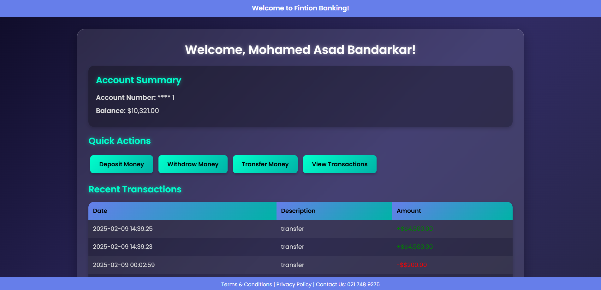

# Fintion Banking App

Fintion Banking App is a simple banking web application that allows users to perform various banking actions like viewing their account details, making transactions, and more. This app provides a user-friendly interface to simulate real-world banking operations.




## Features

- **Account Overview**: View account balance, account number, and user details.
- **Transaction History**: View recent transactions made by the user.
- **Deposit Money**: Deposit money into the account.
- **Withdraw Money**: Withdraw money from the account.
- **Transfer Money**: Transfer money between accounts.
- **Responsive Design**: Works seamlessly on desktop and mobile devices.

## Technologies Used

- **Frontend**:
  - HTML
  - CSS (with custom styling)
  - JavaScript (for interactivity)

- **Backend**:
  - PHP (for server-side scripting)
  - MySQL (for database management)

- **Other Tools**:
  - XAMPP (for local development and database management)

## Installation

To run this project locally, follow these steps:

1. **Clone the repository**:
    ```bash
    git clone https://github.com/yourusername/fintion-banking-app.git
    ```

2. **Setup XAMPP**:
   - Download and install XAMPP from [here](https://www.apachefriends.org/download.html).
   - Start the Apache and MySQL servers in the XAMPP control panel.

3. **Move the project to the htdocs folder:**
   - Copy or move the fintion-banking-app folder into the htdocs directory of your XAMPP installation. This is usually located at:
   - C:\xampp\htdocs\

   - So the full path should look like:
   - C:\xampp\htdocs\fintion-banking-app\

4. **Create the database**:
   - Open phpMyAdmin (accessed via `localhost/phpmyadmin`).
   - Create a new database named `fintion_banking`.
   - Import the `fintion_banking.sql` file (found in the project root) to set up the tables.

5. **Update database credentials**:
   - Open `db.php` and set your MySQL database credentials (host, username, password, database name).

6. **Run the application**:
   - Open your browser and navigate to `http://localhost/fintion-banking-app`.

## Usage

1. **Login**: After logging in, you will be directed to the dashboard where you can see your account details.
2. **Perform Actions**: Use the buttons provided for depositing, withdrawing, transferring money, and viewing transaction history.

## Contributing

Contributions are welcome! If you have any improvements or bug fixes, feel free to fork the repository and create a pull request.

## License

This project is licensed under the MIT License - see the [LICENSE.md](LICENSE.md) file for details.


